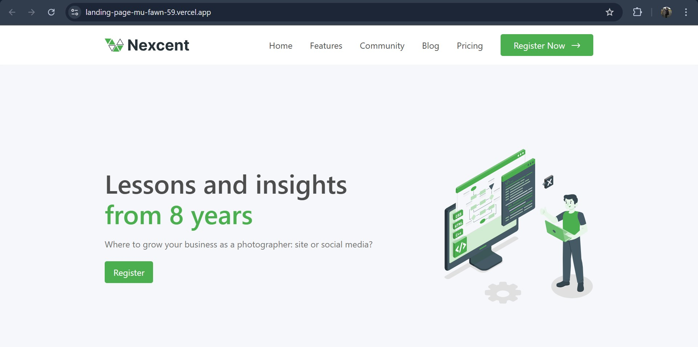

# 🌟 Landing Page Project

Welcome to the **Landing Page Project**, a sleek, responsive, and modern website built using **Vite**, **JavaScript**, and **TailwindCSS**. 🚀

---

## 📖 Features

- ⚡ **Fast and Lightweight**: Built with Vite for optimal performance.
- 💡 **Modern Styling**: Designed with TailwindCSS for simplicity and flexibility.
- 🌐 **Customizable**: Easily adaptable to fit your project needs.

---

## 🛠️ Tech Stack

- **Frontend**: HTML, CSS, JavaScript
- **Styling**: TailwindCSS
- **Build Tool**: Vite
- **Version Control**: Git & GitHub

---

## 🚀 Installation and Setup

Follow these steps to run the project locally:

### 1️⃣ Clone the Repository
```bash
git clone https://github.com/Mukeshzz/landing-page.git
```

### 2️⃣ Navigate to the Project Directory
```bash
cd landing-page
```

### 3️⃣ Install Dependencies
Make sure you have **Node.js** installed, then run:
```bash
npm install
```

### 4️⃣ Start the Development Server
Launch the development server to view the project:
```bash
npm run dev
```

The server will start, and you can view the landing page at `http://localhost:3000`.

---


## 📂 Project Structure

```
landing-page-project/
├── public/             # Static assets
├── src/                # Source code
│   ├── assets/         # Images and other assets
│   ├── components/     # Reusable components
│   ├── App.css         # TailwindCSS styles
│   ├── App.jsx         # Main application file
│   └── main.jsx        # Vite entry file
├── .gitignore          # Git ignore file
├── package.json        # NPM configuration
├── postcss.config.js   # PostCSS configuration
├── tailwind.config.js  # TailwindCSS configuration
└── vite.config.js      # Vite configuration
```

---

## 🛠️ Requirements

- **Node.js**: v16+ recommended
- **Vite**: Pre-installed via the dependencies
- **TailwindCSS**: Pre-configured

---

## **Screenshots**



---

## 📫 Contact

For any queries or feedback, reach out to me at **mukesh7.251097@gmail.com** or connect on [LinkedIn](https://linkedin.com/in/mukeshzz07).


